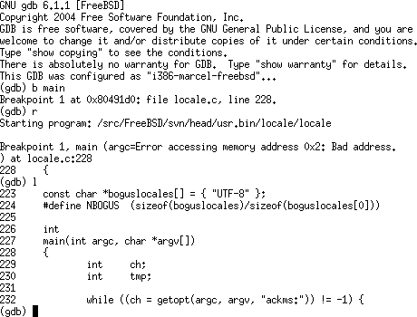
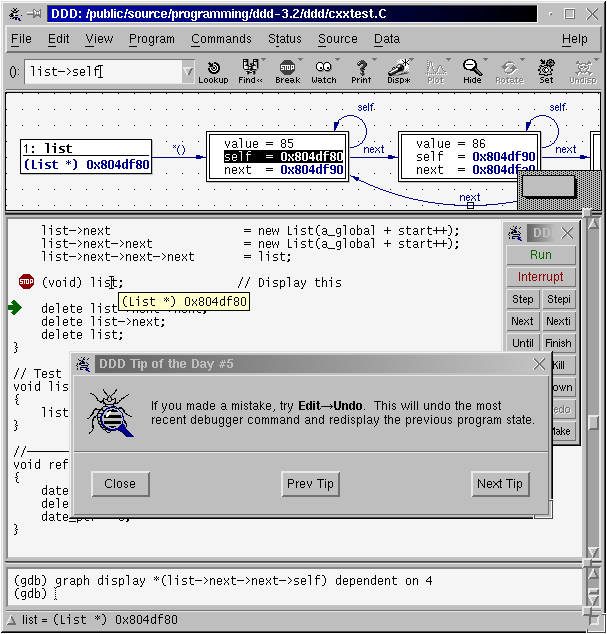

# Introduction



By now you have been writing code in the C language for over a week, and it can be helpful to have some tools that assist you to verify the correctness of those programs. You are going to start by learning how to use a debugger that will be useful for both C and assembly programming (as well as any other future language you use in your career).

# Part 1 - GDB Introduction 

GDB is a debugger for the programs that we are compiling with the GCC compiler. It helps us track down errors in our program. As an example, you may use gdb to step through programs and execute one line at a time to understand what is going on. Learning how to debug errors through a debugger is an essential skill for all computer scientists!

## GDB Training

1. Watch the following video from Greg Law: *Give me 15 minutes and I'll change your view of GDB* [https://www.youtube.com/watch?v=PorfLSr3DDI](https://www.youtube.com/watch?v=PorfLSr3DDI)
2. Next browse this tutorial to get a little more familiar with GDB: [https://www.cs.cmu.edu/~gilpin/tutorial/](https://www.cs.cmu.edu/~gilpin/tutorial/)
3. Then follow the walkthrough below based on the video to get some practice.
	- This will be potentially helpful for the rest of the assignments in this course!

## GDB Walkthrough with a sample program

Provided below is a program called [hello2.c](./hello2.c) (It is the same one from the Greg Law video).

```c
#include <stdio.h>

int main(void){
        int i =0;
	printf("Hello, world\n");
        printf("i is %d\n",i);
	i++;
	printf("i is now %d\n",i);

        return 0;
};
```

Compile the program with debug symbols(The *-g* flag does this).
- `gcc hello2.c -g -o hello2`
- `gdb ./hello2`
- Then run the program by typing `r` when inside gdb.
	- The program is now executing as normal--however it is being monitored by the gdb debugger.

## GDB TUI (Text User Interface)

Here are the instructions for the TUI part of the Greg Law video (roughly) written out so you can follow along. Practice using them with the program above.

- Type: `start`
- Type: `list`
- You can type `next` (or simply `n`) to execute the next line of code.
- Then press [Ctrl+x a] (Press Ctrl and x at the same time, then press 'a' key after--this may take practice)
  - (Pressing [Ctrl+x a] again will bring you back to just the gdb terminal)
  - Note: If you are having trouble with Ctrl+x, you can type `gdb ./hello -tui` to launch the program.
- Typing in 'next' again moves another line (or simply hit 'enter' which repeats the previous command).
- Ctrl+L will clear the screen after the text prints to clean it up.
- Now try hitting [Ctrl+x 2]
  - You will now see multiple windows with the assembly and the source code.
  - Pressing [Ctrl+x o] will cycle between the windows.
  - Hitting [Ctrl+x 2] a couple of times will cycle through the windows to show what is in the registers.
    - Typing `tui reg` will give some options to see specific registers.
      - For example, `tui reg float` shows the floating registers.
      - For example, `tui reg general` displays the general purpose registers.
 - Hit [Ctrl+x 1] to go back to the first view and see your source code.
   - Typing in some commands like 'layout src' will bring you back to your source view.
     - Typing in 'layout asm' will show you the assembly.
- More: [https://sourceware.org/gdb/onlinedocs/gdb/TUI-Commands.html#TUI-Commands](https://sourceware.org/gdb/onlinedocs/gdb/TUI-Commands.html#TUI-Commands)
- More: [https://sourceware.org/gdb/onlinedocs/gdb/TUI-Keys.html#TUI-Keys](https://sourceware.org/gdb/onlinedocs/gdb/TUI-Keys.html#TUI-Keys)
- More resources on GDB TUI: [https://sourceware.org/gdb/onlinedocs/gdb/TUI.html](https://sourceware.org/gdb/onlinedocs/gdb/TUI.html)
  
## (Optional) GDB Python	

From the Greg Law Video, he demonstrates using an the Python programming langauge within the GDB Tool. Python is a general purpose scripting langauge--perhaps you have even used it! What is neat about Python is that the languages interpreter can be embedded into other tools (and even other programming languages!) as has been shown with GDB.

Here are some of the Python commands written out for your convenience. 
	
- Try the following within GDB:
  - Type: `python print("hello gdb")`
  - Type: `python import os`
  - Type: `python print("my pid is %d" % os.getpid()) # pid = process id`
  - If you have inserted any breakpoints:
    - (Create one with `b main`)
    - Type: `python print(gdb.breakpoints())`
    - Type: `python print(gdb.breakpoints()[0].location)`
    - With Python, you can even create breakpoints!
      - `python gdb.Breakpoint('7')`
    
- Finally typing in `quit` will exit gdb when you are done.

## Your exercise

Run gdb on the programs *prog* and *prog1* included in this repository.

It has been compiled with debugging symbols(*-g*) so you may investigate and view the assembly source (recovering the C source from arbitrary executables is very difficult!). Answer the following questions below.

**Modify** the [exercises.md](./exercises.md) with your answers

# Rubric

<table>
  <tbody>
    <tr>
      <th>Points</th>
      <th align="center">Description</th>
    </tr>
    <tr>
      <td>10% (GDB)</td>
      <td align="left"><ul><li>Did you modify the exercises.md with the correct answers to what the bug was in prog1?</li></ul></td>
    </tr>      
  </tbody>
</table>


# Resources to help

- A full 90+ minutes of GDB debugging
	- [https://www.youtube.com/watch?v=713ay4bZUrw](https://www.youtube.com/watch?v=713ay4bZUrw)
- GDB is very powerful, check out the documentation here!
	- [https://ftp.gnu.org/old-gnu/Manuals/gdb/html_node/gdb_toc.html](https://ftp.gnu.org/old-gnu/Manuals/gdb/html_node/gdb_toc.html)

# Going Further

## Core dumps

In the Greg Law video, he begins to investigate a Core dump file. What exactly is a coredump?

Read here: [https://wiki.archlinux.org/index.php/Core_dump](https://wiki.archlinux.org/index.php/Core_dump)

# Feedback Loop

(An optional task that will reinforce your learning throughout the semester)



- There is a Visual Debugger built on top of gdb that you may use called DDD ([Data Display Debugger](https://www.gnu.org/software/ddd/))
	- DDD is not installed on the servers unfortunately, so you may only use it on your local environment.
	- Since DDD is built on top of GDB (and some other debuggers), everything you learned in gdb you can also use.
	- There are also handy visualizations of data structures as well.
	- A video tutorial on how to use it is displayed here: [https://www.youtube.com/watch?v=VF7IBEAA8Ig](https://www.youtube.com/watch?v=VF7IBEAA8Ig)
